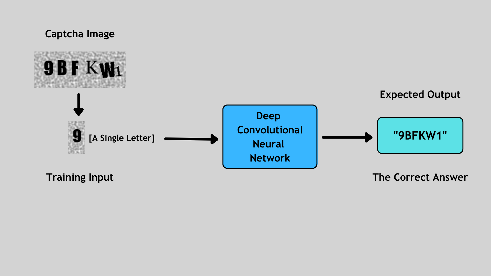

# StealthSolver
#### Crack the toughest captchas with ease using StealthSolver - the CNN-based algorithm with 99% accuracy!

StealthSolver is a state-of-the-art captcha solver that uses a deep learning-based algorithm to accurately crack even the most complex captchas with 99% accuracy. Its advanced neural network architecture is trained on a massive dataset of diverse captcha images, enabling it to identify patterns and shapes with unparalleled precision. Whether it's distorted text, obfuscated symbols, or noisy backgrounds, StealthSolver can handle it all.

### StealthSolver Workflow

### Before you get started

* The purpose of CAPTCHAs is to ensure that forms are filled out by real people rather than computers. However, advancements in deep learning and computer vision have made it relatively simple to bypass these security measures.

* There is a need to have access to the source code of the application generating the CAPTCHA image to break the system.

* Only breaking an open source CAPTCHA system where we do have access to the source code is feasible, irrespective of other methods which consume a lot of time in determining few parameters used in generating captcha images.

To run these scripts, you need the following installed:

1. Python 3
2. OpenCV 3 w/ Python extensions
 - I highly recommend these OpenCV installation guides: 
   https://www.pyimagesearch.com/opencv-tutorials-resources-guides/ 
3. The python libraries listed in requirements.txt
 - Try running "pip3 install -r requirements.txt"

### Step 1: Generate CAPTCHA images

Run:

python3 generate_captcha_images.py

The results will be stored in the "self_generated_captcha_images" folder.

### Step 2: Extract single letters from CAPTCHA images

Run:

python3 single_letter_extractor_from_captchas.py

The results will be stored in the "self_extracted_letter_images" folder.

### Step 3: Train the neural network to recognize single letters

Run:

python3 captcha_detection_model_trainer.py

This will write out "self_captcha_model.hdf5" and "self_model_labels.dat"

### Step 4: Use the model to solve CAPTCHAs!

Run: 

python3 captcha_solver_with_model.py